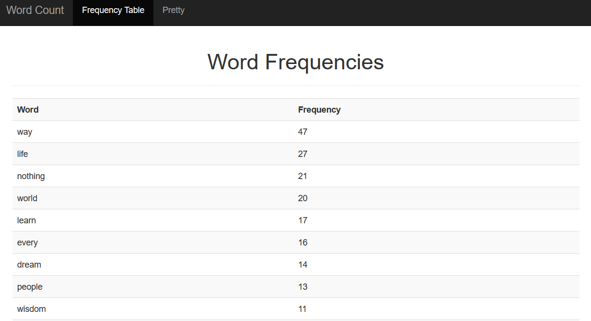

# Tag-cloud

## Important!
```
Create a new user and database baed on:
user_name = 'yash'
user_pwd = '1234'
database_name = 'tag_cloud'
```

Just copy the statements:
```
CREATE USER 'yash'@'localhost' IDENTIFIED BY '1234';
GRANT ALL PRIVILEGES ON tag_cloud.* TO 'yash'@'localhost';
CREATE DATABASE 'tag_cloud';
```

## Screenshots


